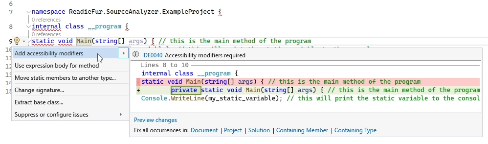
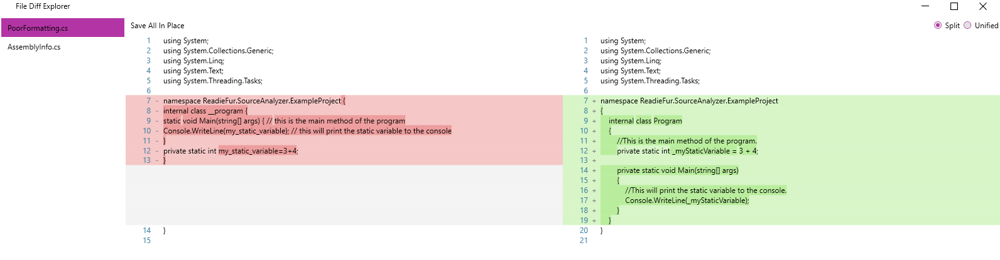

# Source Code Quality Enhancer - Dissertation project for BEng (Hons) Software Engineering, University of Greenwich <!-- omit from toc -->
This repository contains the source code for the dissertation project for the BEng (Hons) Software Engineering course at the University of Greenwich. The goal of this project was to create a tool that can analyze source code and reformat it to a user defined style with support for object oriented programming principles in correlation with design patterns to create a well structured and higher quality codebase from a pre-existing codebase or to aid in the development of a new project with enforced coding standards.  
For this project I was awarded a grade of 76% and my course overall was awarded First Class Honours.

## Table of Contents <!-- omit from toc -->
- [Project overview](#project-overview)
  - [Introduction](#introduction)
  - [Project overview](#project-overview-1)
  - [Considerations](#considerations)
- [Project development](#project-development)
  - [Project management](#project-management)
  - [Key features](#key-features)
    - [Integration](#integration)
    - [User defined configuration](#user-defined-configuration)
    - [Naming engine](#naming-engine)
    - [Document formatting](#document-formatting)
    - [Language features](#language-features)
  - [Testing, examples and issues](#testing-examples-and-issues)
  - [Future work](#future-work)
- [Repository structure](#repository-structure)
  - [Report](#report)
  - [Program](#program)
- [Project feedback](#project-feedback)
- [References](#references)

## Project overview
This section provides an overview of the project and the considerations that were made before undertaking the development of the project.

### Introduction
This project seeks to present a solution to the problem of software source code quality by creating a tool that can analyze source code and reformat it to a user defined style with support for object oriented programming principles in correlation with design patterns to create a well structured and higher quality codebase from a pre-existing codebase or to aid in the development of a new project with enforced coding standards.

### Project overview
The paper found in this repository discusses the current state of source code quality and the importance of maintaining a high
quality codebase. It demonstrates how there is a lack of uniformity in coding styles and how this can lead to a decrease in efficiency within development teams and thereby cause increased costs and time to develop a project. The paper also shows an in-depth implementation of a program that can aid in increasing software quality and how it can be used to reformat source code to a user defined style with support for object oriented programming principles in combination with design patterns to create a well structured and higher quality codebase from a pre-existing codebase, or from scratch. Throughout this paper the use of the spiral software development methodology is used as the development framework and the continuous integration pipeline is used during the practical implementation of the project.

### Considerations
Before undertaking the development of this project, a number of considerations must made to ensure that the project would be successful. A first consideration is the choice of programming language. It has been decided that the project would be developed in and for the C# language as this is a widely used making this a valid candidate for this project. While it would be desirable to create a tool that supports multiple languages, this would have a significant impact on the complexity of the project and so it was decided that the project would be limited to C# due to the time restraints of the project in addition to my knowledge of other languages not being as strong as that of C#. As previously discussed, software quality does not have a set-in-stone definition, so in order to measure the quality of the software that is produced a baseline of things will be measured, such as consistency of the code, maintainability through the use of up-to-date language features, the use of object oriented programming principles and design patterns, and the ease of readability of the code. These are all important factors that can be used to measure the quality of the software that is produced in this project.

## Project development
This section provides an overview of the key features, discoveries I had made and examples of the tool in action. The full details of the project development can be found in the [report](./dist/Report.pdf).

### Project management
When undertaking large projects, it is often recommended to use a project management tool to help keep track of the progress and changes made to the project. Throughout the development lifecycle of this project GitHub was used extensively to track changes and issues. I had used GitHub to roll back changes during certain parts of development when I had encountered issues that I could not resolve.

### Key features
#### Integration
The product that was developed was split into various modules. Each module was designed to be independent from one another. This has multiple advantages, such as making the code easier to maintain and allowing for easier debugging and modification. Due to time restraints only two tools were generated, a plugin for the Visual Studio IDE using the VSIX plugin format which would allow for direct IDE integration and inline hints to the developer. The second tool was a standalone tool that would allow for batch reformatting of an entire C# solution, this tool would recursively search through the solution and correct any files that it found that did not meet the user defined configuration, and then present the user with a list of files and a diff preview of the changes that would be made to the files. The user would then be able to accept or reject the changes that were made to the files.

#### User defined configuration
As already noted, the lack of standardization in code formatting has lead to a key aim of this tool to be able to be configured by the user. It was also noted that this would be achieved through the use of a YAML configuration file. Depending on how strict the work environment to be made, the severity can be set to cause an
error which will result in not allowing the program to compile. 

#### Naming engine
The naming engine turned out to be one of the most complex parts of the project. The naming engine is responsible for checking the names of various parts of the codebase, such as classes, methods, and variables and then converting them to match the user-defined configuration. The naming engine is split into multiple modules: the diagnostic module, code fix module; and the regex engine module. The diagnostic module uses the Roslyn API to parse the codebase and analyze objects, classes, methods, and variables.  
A custom regex engine was necessary to allow for the conversion of the names to match the user-defined configuration. The reason for this is because most of the publicly available existing regex engines are not able to restructure an input string to match a pattern. This custom regex engine was based on the POSIX standard and is able to use digest simple patterns and restructure an input string to match the specified pattern as best as it can.  
Regex patterns are parsed into a token tree, the choice for representing the pattern data in a tree structure was made
to allow for easy manipulation of the pattern. All recognized token classes within this regex engine inherit from the base AToken abstract class which contains common properties and interfaces that all tokens must implement. This base class contains properties for the local pattern that the token represents, its parent, children, previous and next tokens in addition to various abstract and virtual methods.  
This component of the project is rather advanced and too complex to simply summarize here. It is advised that the reader reads the [full report](./dist/Report.pdf) to gain a full understanding of the naming engine.

#### Document formatting
The tool provides options to force comments to be on their own lines, or inline with code and additionally choose wether comments should have a leading space or a trailing full stop. Within the user configuration file, an additional option can also be specified to set the sensitivity of the comment detection. By default this value is set to 50% meaning that if the number of characters matched in the pattern is greater than 50% of the total number of characters in the comment token string, it is to be considered a comment.  

Indentation levels for a given line the document is navigated line-by-line. A last-in-first-out (LIFO) stack is created to hold information about the current context level. A context level is determined by the following tokens: `{` `}` `(` `)` `[` `]`.  

The punctuation sub-module allows the user to configure the spacing around punctuation, and wether punctuation this should be on the same line as the previous token or on a new line. Within the YAML configuration file the user has the ability to define as many punctuation rules as they desire.  

The object structure sub-module is rather minimal but can have a major impact on code readability. It provides the user with the option to force object properties and fields to be at the top of the object declaration with all methods at the bottom. This has a significant impact on readability and debugging as it contributes to reducing the amount of spaghetti code.

#### Language features
The language features module provides automation for updating code to support new language specific features. Currently, this module contains support for features such as inferred access modifiers and the implicit object initialization syntax that was introduced in C# 9.0.

### Testing, examples and issues
Unit tests were the primary method of testing the project. Unit tests are particularly useful for an algorithmic system as it allows for the testing of individual components in isolation. In addition to this regression testing, which is the process of testing a program to ensure that changes to one part of the program have not affected other parts of the program, has been used. This testing pattern is particularly useful for this project as it has been build in a modular fashion.

A significant amount of time was spent constantly testing the components of the tool to ensure that they were functioning correctly and as expected. Automated unit test executions were setup so that after each new build of the program, the tests would be re-run. Most of the tests yielded the expected results most of the time, with the exception of a few edge cases that were not major enough to be fixed, in particular any code fix providers that would enter new lines to a document would not always use the correct line ending for the operating system that the tool was running on. This was not fixed as it was not a major issue and would not affect the functionality of the tool. Of the automated tests conducted, fifty-eight were created of which fifty-five were successful. The three tests that failed were due to the line ending issue mentioned above. Given the success rate of 94.8%, it can be concluded that the tool is functioning well within a passable margin of error and is ready enough for real-world use.  

Visual Studio integration:  

Standalone tool:  

<!-- ### Discoveries -->

### Future work
By limiting the scope of the project to a single language, the project was able to be completed within the time frame set out. however, this has the downside of not being able to restructure code in other languages which is a particularly large limitation of this tool given that in recent years, web-based languages such as Typescript and Javascript as well as Python for AI based tasks, have become increasingly popular. By not making this tool multi-language compatible, it cannot be used to aid in enforcing coding standards to these other popular languages. If the project had a longer time frame and delivery period and with more resources available it would’ve been feasible to incorporate such a feature with more resources.

## Repository structure
This section provides an overview of the repository structure and the contents of the repository.

### Report
The [report](./report/Main.pdf) for this project can be found in the [report](./report) directory. The report is in PDF format and contains the full details of the project development.

### Program
The source code for the project can be found in the [src](./src) directory. The source code is split into multiple projects, each project is a module of the tool.  
Precompiled binaries can be found in the [dist](./dist) directory. The binaries are split into two directories, one for the Visual Studio plugin and one for the standalone tool.

## Project feedback
The full feedback for this project can be found in the [FYP feedback pdf](./FYP_Feedback.pdf) file. Within this file feedback from my two project supervisors, John Ewer and Cornelia Boldyreff, is provided. The feedback is generally positive with the project being awarded a grade of 76% and my course overall being awarded First Class Honours.

## References
Please see the References section of the [report](./dist/Report.pdf) for the full list of references, citations and libraries used in this project.  
